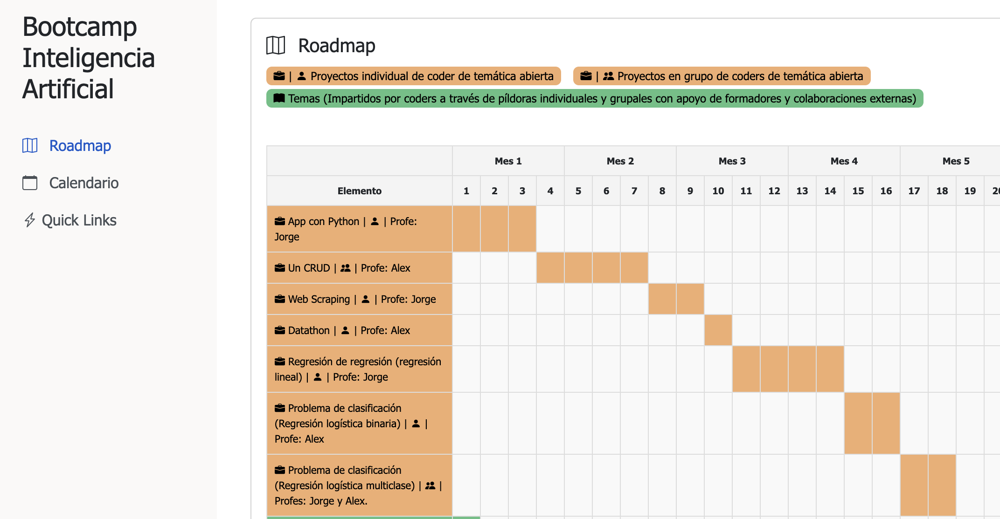

# Dashboard de estudiantes y mapa de ruta del bootcamp




https://factoria-f5-dev.github.io/roadmap-ia/

Este proyecto consiste en un dashboard de estudiantes y una visualización del Mapa de Ruta del Bootcamp. Está diseñado para proporcionar a los estudiantes un acceso fácil a enlaces y recursos importantes, así como una representación visual del plan de estudios del bootcamp.

## Estructura del Proyecto

El proyecto está estructurado de la siguiente manera:

- `index.html`: La página principal del dashboard
- `style.css`: Estilos para el dashboard
- `script.js`: JavaScript para el dashboard y el diagrama de Gantt
- `roadmap/roadmap.html`: La página de visualización del diagrama de Gantt
- `roadmap/roadmap.css`: Estilos específicos para el diagrama de Gantt

## Cómo Modificar el Código

### Modificar el Dashboard (index.html)

1. **Enlaces de la Barra Lateral**: Para modificar los enlaces de la barra lateral, edita la sección `<nav>` en `index.html`. Cada enlace está representado por un elemento `<li>`.

2. **Contenido Principal**: El contenido principal está dividido en tarjetas. Modifica los elementos `<div class="card">` para cambiar el contenido de cada tarjeta.

3. **Calendario**: Reemplaza el src del iframe con tu enlace de inserción de Google Calendar.

### Modificar Estilos (style.css y roadmap.css)

- `style.css` contiene estilos para el dashboard principal.
- `roadmap.css` contiene estilos específicos para el diagrama de Gantt.

Modifica estos archivos para cambiar colores, diseños u otros aspectos visuales del dashboard y el diagrama de Gantt.

### Modificar JavaScript (script.js)

1. **Enlaces del Dashboard**: Para cambiar los enlaces de los botones del dashboard, modifica el objeto `links` al principio del archivo.

2. **Datos del Diagrama de Gantt**: El array `data` contiene la información para el diagrama de Gantt. Cada objeto en este array representa un proyecto o tema en el bootcamp. Para modificar el plan de estudios:

   - Añade, elimina o modifica objetos en el array `data`.
   - Cada objeto debe tener un `type` ("Proyecto" o "Tema"), un `name`, y opcionalmente `start` y `end` para las semanas.
   - Si no se proporcionan `start` y `end`, se calcularán automáticamente basándose en los elementos anteriores.

   Ejemplo:
   ```javascript
   {
     type: "Proyecto",
     name: "Nuevo Proyecto",
     start: 19,
     end: 21
   }
